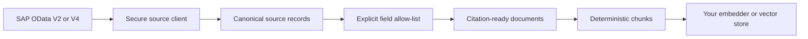

# SAP Knowledge Pipeline

Turn selected SAP OData business objects into secure, citation-ready knowledge
for retrieval-augmented generation (RAG).

> [!IMPORTANT]
> This project is an early technical foundation. It is not affiliated with or
> endorsed by SAP. It does not grant access to SAP systems or reproduce SAP's
> authorization model.

## How it fits together



The package stops before the final target on purpose. Its output is portable,
so an application can choose OpenAI, a local embedding model, pgvector,
Qdrant, SAP HANA Cloud, or another store without changing SAP extraction.

## Current milestone

The first milestone provides the protocol layer required by the later knowledge
pipeline:

- OData V2 and V4 JSON page parsing.
- Server-driven pagination using opaque continuation links.
- Continuation-host validation to prevent credential leakage and SSRF.
- V4 changed and deleted entity handling.
- EDMX metadata inspection for entity sets, keys, properties, and navigation
  properties.
- An async HTTP client that can be tested without a live SAP system.
- Declarative recipes that allow-list fields before they enter RAG.
- Deterministic knowledge documents, citations, and character-aware chunks.
- A conservative SAP Business Partner starter recipe.

Embedding providers, durable checkpoints, and vector-store adapters will be
added after the source and transformation contracts are stable.

## Development setup

```console
python -m venv .venv
```

```console
# Windows PowerShell
.venv\Scripts\Activate.ps1
python -m pip install --group dev -e .

# macOS or Linux
source .venv/bin/activate
python -m pip install --group dev -e .
```

Then run the complete local quality suite:

```console
ruff check .
ruff format --check .
mypy src
pytest
```

## Minimal source example

```python
import asyncio

import httpx

from sap_knowledge.sources.odata import ODataClient, ODataVersion


async def main() -> None:
    async with httpx.AsyncClient() as http:
        client = ODataClient(
            service_root="https://services.odata.org/V4/TripPinServiceRW/",
            version=ODataVersion.V4,
            http=http,
        )

        metadata = await client.metadata()
        people = metadata.entity_set("People")

        async for page in client.pages("People", key_fields=people.keys):
            for record in page.records:
                print(record.key, record.data)


asyncio.run(main())
```

The same client can consume a configured SAP OData service. Credentials should
be supplied through an `httpx.AsyncClient` authentication configuration and
must never be committed to the repository.

## SAP Business Partner to RAG chunks

Recipes are security boundaries as well as rendering instructions. Only the
properties listed by the recipe enter the document text or metadata; an
unexpected field in the OData response is ignored.

```python
import asyncio
import os

import httpx

from sap_knowledge import CharacterChunker, KnowledgeRenderer
from sap_knowledge.recipes import BUSINESS_PARTNER
from sap_knowledge.sources.odata import ODataClient, ODataVersion


async def main() -> None:
    async with httpx.AsyncClient(
        auth=(os.environ["SAP_USER"], os.environ["SAP_PASSWORD"]),
        timeout=30,
    ) as http:
        source = ODataClient(
            service_root=os.environ["SAP_ODATA_SERVICE_ROOT"],
            version=ODataVersion.V2,
            http=http,
        )
        renderer = KnowledgeRenderer()
        chunker = CharacterChunker(max_characters=1200, overlap_characters=120)

        async for page in source.pages(
            BUSINESS_PARTNER.entity_set,
            key_fields=BUSINESS_PARTNER.key_fields,
            select=BUSINESS_PARTNER.select_fields,
        ):
            for record in page.records:
                document = renderer.render(record, BUSINESS_PARTNER)
                for chunk in chunker.split(document):
                    # Send chunk.text and chunk.metadata to your chosen target.
                    print(chunk.model_dump_json())


asyncio.run(main())
```

Every chunk includes:

- A stable chunk and document ID.
- The rendered, embedding-ready text.
- The OData entity set and complete business key.
- The source ETag when supplied by SAP.
- The recipe and document type.

Stable IDs let a later sink upsert changed chunks without duplicating them.
The structured citation lets a RAG application show where an answer came from.

### Defining a custom recipe

```python
from sap_knowledge import FieldMapping, KnowledgeRecipe

MATERIAL = KnowledgeRecipe(
    name="material",
    entity_set="A_Product",
    key_fields=("Product",),
    title_fields=("ProductName", "Product"),
    document_type="sap_material",
    fields=(
        FieldMapping(source="ProductName", label="Product name"),
        FieldMapping(source="Product", label="Product ID", required=True),
        FieldMapping(source="ProductType", label="Product type"),
        FieldMapping(source="BaseUnit", label="Base unit"),
    ),
)
```

Pass `MATERIAL.select_fields` to `ODataClient.pages()`. This requests only the
keys and allowed properties and provides a second guard in case the service
returns additional data.

> [!CAUTION]
> Field allow-listing does not replace SAP authorization. Use a least-privilege
> technical user, validate which business data may leave SAP, and apply tenant
> or user-level authorization again when retrieving chunks.

## Contributing

Contributions are welcome, including small fixtures and documentation fixes.
Read [CONTRIBUTING.md](CONTRIBUTING.md) for setup, testing, pull-request, and
SAP test-data safety guidance.
