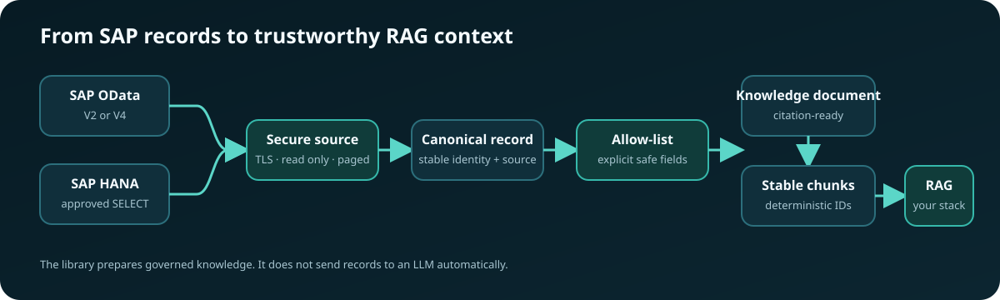

<div align="center">

# SAP Knowledge Pipeline

**Turn selected SAP OData and HANA business records into secure,
citation-ready knowledge for RAG.**

[](https://pypi.org/project/sap-knowledge-pipeline/)
[](https://pypi.org/project/sap-knowledge-pipeline/)
[](https://github.com/yassinbahri/sap-knowledge-pipeline/actions/workflows/ci.yml)
[](LICENSE)
[](CHANGELOG.md)


[Install](#installation) · [OData](#minimal-source-example) ·
[HANA](#sap-hana-to-rag-chunks) · [RAG search](#local-vector-search-and-rag-context) ·
[Contribute](CONTRIBUTING.md)

</div>

> [!IMPORTANT]
> This project is an early technical foundation. It is not affiliated with or
> endorsed by SAP. It does not grant access to SAP systems or reproduce SAP's
> authorization model.

## Installation

Install the core OData and knowledge-transformation package:

```console
python -m pip install sap-knowledge-pipeline
```

Choose optional integrations explicitly:

```console
python -m pip install "sap-knowledge-pipeline[hana]"
python -m pip install "sap-knowledge-pipeline[fastembed]"
python -m pip install "sap-knowledge-pipeline[all]"
```

Python 3.11 through 3.14 are supported. This is an early alpha release: pin the
version, test recipes against non-production data first, and review the
[known limitations](#known-limitations) before adopting it.

## How it fits together



See the [project roadmap](ROADMAP.md) for planned releases and contribution opportunities.

The package's synchronization events are portable, so an application can
choose OpenAI, a local embedding model, pgvector, Qdrant, SAP HANA Cloud, or
another store without changing SAP extraction.

The optional Qdrant integration now provides the first end-to-end local target.

## Current milestone

The first milestone provides the protocol layer required by the later knowledge
pipeline:

- OData V2 and V4 JSON page parsing.
- Server-driven pagination using opaque continuation links.
- Continuation-host validation to prevent credential leakage and SSRF.
- V4 changed and deleted entity handling.
- EDMX metadata inspection for entity sets, keys, properties, and navigation
  properties.
- An async HTTP client that can be tested without a live SAP system.
- Declarative recipes that allow-list fields before they enter RAG.
- Deterministic knowledge documents, citations, and character-aware chunks.
- A conservative SAP Business Partner starter recipe.
- Certificate-validated SAP HANA connections through the optional SAP
  `hdbcli` driver.
- Explicit, parameterized HANA `SELECT` datasets streamed in bounded pages.
- Local FastEmbed embeddings and a persistent Qdrant knowledge index.

OData synchronization includes durable checkpoints and delta-link handling.
The initial HANA adapter performs snapshot reads; resumable keyset pagination
and deletion tracking remain future work.

## Known limitations

- HANA snapshot synchronization and safe catalog inspection are available from
  the TOML CLI.
- HANA synchronization is snapshot-only and does not reconcile deleted rows.
- The package does not infer SAP module semantics, authorization scope, or safe
  fields from table names.
- Only Business Partner has a built-in recipe; other datasets require an
  explicit `KnowledgeRecipe`.
- Qdrant local mode is intended for development and smaller indexes.
- No LLM is called automatically. Applications decide where retrieved context
  is sent.

## Development setup

```console
python -m venv .venv
```

```console
# Windows PowerShell
.venv\Scripts\Activate.ps1
python -m pip install --group dev -e .

# macOS or Linux
source .venv/bin/activate
python -m pip install --group dev -e .
```

Then run the complete local quality suite:

```console
ruff check .
ruff format --check .
mypy src
pytest
```

## Minimal source example

```python
import asyncio

import httpx

from sap_knowledge.sources.odata import ODataClient, ODataVersion


async def main() -> None:
    async with httpx.AsyncClient() as http:
        client = ODataClient(
            service_root="https://services.odata.org/V4/TripPinServiceRW/",
            version=ODataVersion.V4,
            http=http,
        )

        metadata = await client.metadata()
        people = metadata.entity_set("People")

        async for page in client.pages("People", key_fields=people.keys):
            for record in page.records:
                print(record.key, record.data)


asyncio.run(main())
```

The same client can consume a configured SAP OData service. Credentials should
be supplied through an `httpx.AsyncClient` authentication configuration and
must never be committed to the repository.

## SAP Business Partner to RAG chunks

Recipes are security boundaries as well as rendering instructions. Only the
properties listed by the recipe enter the document text or metadata; an
unexpected field in the OData response is ignored.

```python
import asyncio
import os

import httpx

from sap_knowledge import CharacterChunker, KnowledgeRenderer
from sap_knowledge.recipes import BUSINESS_PARTNER
from sap_knowledge.sources.odata import ODataClient, ODataVersion


async def main() -> None:
    async with httpx.AsyncClient(
        auth=(os.environ["SAP_USER"], os.environ["SAP_PASSWORD"]),
        timeout=30,
    ) as http:
        source = ODataClient(
            service_root=os.environ["SAP_ODATA_SERVICE_ROOT"],
            version=ODataVersion.V2,
            http=http,
        )
        renderer = KnowledgeRenderer()
        chunker = CharacterChunker(max_characters=1200, overlap_characters=120)

        async for page in source.pages(
            BUSINESS_PARTNER.entity_set,
            key_fields=BUSINESS_PARTNER.key_fields,
            select=BUSINESS_PARTNER.select_fields,
        ):
            for record in page.records:
                document = renderer.render(record, BUSINESS_PARTNER)
                for chunk in chunker.split(document):
                    # Send chunk.text and chunk.metadata to your chosen target.
                    print(chunk.model_dump_json())


asyncio.run(main())
```

Every chunk includes:

- A stable chunk and document ID.
- The rendered, embedding-ready text.
- The OData entity set and complete business key.
- The source ETag when supplied by SAP.
- The recipe and document type.

Stable IDs let a later sink upsert changed chunks without duplicating them.
The structured citation lets a RAG application show where an answer came from.

## SAP HANA to RAG chunks

Install the optional SAP HANA driver:

```console
python -m pip install "sap-knowledge-pipeline[hana]"
```

Use a dedicated database principal with only `SELECT` privileges on approved
views. The package rejects obvious multi-statement and non-`SELECT` input,
but SQL-text validation is not an authorization boundary. Database grants are
the security boundary.

Keep connection values in environment variables:

```powershell
$env:SAP_HANA_ADDRESS = "your-host.hanacloud.ondemand.com"
$env:SAP_HANA_PORT = "443"
$env:SAP_HANA_USER = "your-read-only-user"
$env:SAP_HANA_PASSWORD = "your-password"
```

Define an explicit dataset and its stable business key:

```python
import os

from sap_knowledge.sources.hana import HanaClient, HanaDataset


products = HanaDataset(
    name="PRODUCT_KNOWLEDGE",
    statement=(
        'SELECT "PRODUCT_ID", "PRODUCT_NAME", "DESCRIPTION" '
        'FROM "RAG_READ"."PRODUCT_KNOWLEDGE" '
        'WHERE "ACTIVE" = ? ORDER BY "PRODUCT_ID"'
    ),
    key_fields=("PRODUCT_ID",),
    parameters=(True,),
)

with HanaClient.connect(
    address=os.environ["SAP_HANA_ADDRESS"],
    port=int(os.environ.get("SAP_HANA_PORT", "443")),
    user=os.environ["SAP_HANA_USER"],
    password=os.environ["SAP_HANA_PASSWORD"],
) as source:
    for page in source.pages(products, page_size=500):
        for record in page.records:
            print(record.model_dump_json())
```

Connections always request encryption and certificate validation. Query
parameters are passed separately to the SAP driver. Duplicate result-column
names, missing business keys, and null key values fail before records enter the
knowledge pipeline. See `examples/hana_to_rag.py` for transformation into
citation-ready chunks.

The adapter works at the HANA SQL layer. It is not specific to S/4HANA: an ECC
EHP8 system on HANA, S/4HANA, HANA Cloud, or a custom HANA application can all
be sources when the configured user can read a stable view or query. The
meaning and safety of SAP application tables still belongs in an explicit
recipe or curated database view.

### Discover accessible HANA metadata

Catalog discovery returns only metadata visible to the connected principal.
It does not select business rows:

```python
with HanaClient.connect(
    address=os.environ["SAP_HANA_ADDRESS"],
    port=int(os.environ.get("SAP_HANA_PORT", "443")),
    user=os.environ["SAP_HANA_USER"],
    password=os.environ["SAP_HANA_PASSWORD"],
) as source:
    catalog = source.catalog()
    for schema in catalog.schemas():
        for database_object in catalog.objects(schema):
            columns = catalog.columns(schema, database_object.name)
            print(schema, database_object.name, columns)
```

System schemas are excluded by default. HANA system views filter their results
according to the connected user's privileges. Do not grant `CATALOG READ` to a
production ingestion account merely to make discovery easier; create a curated
schema or grant `SELECT` only on approved views instead.

The same discovery workflow is available from the CLI when `source = "hana"`:

```console
sap-knowledge --config sap-hana.toml inspect
sap-knowledge --config sap-hana.toml inspect --schema RAG_READ
sap-knowledge --config sap-hana.toml inspect --schema RAG_READ --object PRODUCT_KNOWLEDGE --json
```

Use `--include-system` only for local troubleshooting. The CLI never prints the
configured HANA password and does not include SQL parameters in catalog output.

### Write HANA snapshot events

`HanaSnapshotKnowledgePipeline` connects HANA to the same portable JSONL event
format consumed by the Qdrant indexer:

```python
pipeline = HanaSnapshotKnowledgePipeline(
    source=source,
    dataset=products,
    recipe=product_recipe,
    sink=JsonlEventSink("data/hana-product-events.jsonl"),
)
result = await pipeline.run()
```

Snapshot events have deterministic IDs, so rerunning the same approved query
upserts the same documents. This initial implementation does not yet detect
rows that disappeared between snapshots; incremental cursors and deletion
reconciliation are still required for production synchronization.

You can also run a HANA snapshot through the same CLI event writer. Copy
`sap-hana.example.toml`, set the HANA credentials in the process environment,
and run `sync`:

```powershell
Copy-Item sap-hana.example.toml sap-hana.toml
$env:SAP_HANA_USER = "your-read-only-user"
$env:SAP_HANA_PASSWORD = "your-password"
sap-knowledge --config sap-hana.toml sync
```

The `[hana]` section stores environment-variable names, dataset identity, one
explicit `SELECT`, key fields, optional parameters, and page size. It must not
contain literal passwords.

### SAP module coverage

The extraction and RAG layers are module-neutral. FI/CO, MM, SD, PM, HCM,
SuccessFactors replication data, industry add-ons, and custom `Z*` objects can
all use the same pipeline when represented as stable rows. Module-specific
support is not automatic: joins, organizational scope, authorization rules,
business terminology, keys, sensitive-field exclusions, and change tracking
must be defined by a curated view or explicit query and a `KnowledgeRecipe`.

The only built-in SAP business recipe currently included is the OData Business
Partner recipe. HANA module recipes should be added one validated use case at a
time rather than guessing directly from SAP table names.

## Command-line usage

Copy the supplied configuration template and edit the service URL:

```console
cp sap-knowledge.example.toml sap-knowledge.toml
```

On Windows PowerShell:

```powershell
Copy-Item sap-knowledge.example.toml sap-knowledge.toml
$env:SAP_USER = "your-technical-user"
$env:SAP_PASSWORD = "your-password"
```

The TOML file contains environment-variable **names**, never passwords or
tokens:

```toml
[service]
root = "https://your-sap-host.example/sap/opu/odata/sap/API_BUSINESS_PARTNER/"
version = "2"
username_env = "SAP_USER"
password_env = "SAP_PASSWORD"

[pipeline]
recipe = "business_partner"
events_path = "data/business-partner-events.jsonl"
checkpoint_path = "state/business-partner.json"
max_characters = 1200
overlap_characters = 120
```

SAP Business Accelerator Hub sandboxes use an API key instead of Basic
authentication. Copy `sap-business-partner-sandbox.example.toml`, obtain your
personal key from SAP, and set it only in the process environment:

```powershell
$env:SAP_API_KEY = "your-personal-sandbox-key"
sap-knowledge --config sap-business-partner-sandbox.example.toml inspect
sap-knowledge --config sap-business-partner-sandbox.example.toml sync
```

The corresponding configuration uses:

```toml
api_key_env = "SAP_API_KEY"
api_key_header = "APIKey"
```

Inspect the service before extracting data:

```console
sap-knowledge --config sap-knowledge.toml inspect
sap-knowledge --config sap-knowledge.toml inspect --entity-set A_BusinessPartner --json
```

For HANA configurations, inspect accessible schemas, objects, or columns:

```console
sap-knowledge --config sap-hana.toml inspect
sap-knowledge --config sap-hana.toml inspect --schema RAG_READ
sap-knowledge --config sap-hana.toml inspect --schema RAG_READ --object PRODUCT_KNOWLEDGE --json
```

Validate configuration and source metadata before reading any business rows or
writing events:

```console
sap-knowledge --config sap-knowledge.toml validate
sap-knowledge --config sap-knowledge.toml validate --json
```

For OData, `validate` requests only the service `$metadata` document and checks
the configured recipe's entity set, keys, and selected properties. For HANA,
set both `catalog_schema` and `catalog_object` to check the recipe fields against
privilege-filtered catalog columns. Without those explicit lineage values, HANA
validation still checks configuration, recipe, dataset, and key invariants but
reports that column compatibility was not checked. It never executes the
configured business-row `SELECT`.

Validation proves compatibility with metadata visible at that moment. It does
not prove authorization for every future row or guarantee that source metadata
will remain unchanged.

Run or resume synchronization:

```console
sap-knowledge --config sap-knowledge.toml sync
```

The CLI validates the built-in recipe against live EDMX metadata before it
requests business data. It fails early when an entity set, key, or selected
property is unavailable.

Inspect checkpoint status without revealing its URLs:

```console
sap-knowledge --config sap-knowledge.toml checkpoint
```

`--reveal-cursors` is available for careful local debugging. Avoid copying its
output into logs or issue reports. You can also run the CLI as
`python -m sap_knowledge`.

## Local vector search and RAG context

Install the optional local embedding and Qdrant dependencies:

```console
python -m pip install "sap-knowledge-pipeline[fastembed]"
```

### Scope retrieval with SAP metadata

Business authorization fields should usually control retrieval without becoming part of the
embedded text. Add explicit metadata mappings when defining a recipe:

```python
from sap_knowledge.knowledge import FieldMapping, KnowledgeRecipe, MetadataMapping

recipe = KnowledgeRecipe(
    name="maintenance_orders",
    entity_set="MaintenanceOrders",
    key_fields=("OrderID",),
    title_fields=("Description",),
    fields=(
        FieldMapping(source="Description", label="Description", required=True),
        FieldMapping(source="Status", label="Status"),
    ),
    metadata=(
        MetadataMapping(source="CompanyCode", key="sap_company_code", required=True),
        MetadataMapping(source="AllowedRoles", key="security_roles", required=True),
    ),
)
```

Metadata fields are requested from SAP and stored with each chunk, but are not placed in the
document text or sent to the embedding model. Require them when searching:

```python
hits = index.search(
    "Which pumps need maintenance?",
    filters={
        "sap_company_code": "1000",
        "security_roles": "MAINTENANCE",
    },
)
```

The CLI supports the same fail-closed query shape. Repeating one key means “any of these values”;
different keys are combined with “and”:

```console
sap-knowledge search "Which pumps need maintenance?" \
  --filter sap_company_code=1000 \
  --filter security_roles=MAINTENANCE
```

These filters are an enforcement building block, not an identity or authorization provider. The
application must derive filter values from a trusted authenticated identity and must never accept
tenant, company-code, or role filters directly from an untrusted user request.

For a source checkout:

```console
python -m pip install -e ".[fastembed]"
```

The sandbox example config includes a persistent local Qdrant index and the
small English BGE embedding model:

```toml
[vector]
path = "data/qdrant-business-partners"
collection = "sap_business_partners"
model = "BAAI/bge-small-en-v1.5"
model_cache_path = "state/embedding-models"
batch_size = 128
```

After `sync` has produced the JSONL events, embed and index them:

```console
sap-knowledge --config sap-business-partner-sandbox.example.toml index
```

Run semantic retrieval:

```console
sap-knowledge --config sap-business-partner-sandbox.example.toml search \
  "industrial manufacturing and engineering company" --limit 3
```

Results contain the score, source text, document and chunk IDs, and the
original SAP entity set and business key. To create a grounded prompt that can
be sent to any chat model:

```console
sap-knowledge --config sap-business-partner-sandbox.example.toml prompt \
  "Which business partners manufacture industrial components?" --limit 5
```

The prompt requires numbered citations, tells the model to use only retrieved
sources, and treats SAP text as untrusted data rather than instructions. Prompt
construction does not call an LLM or send SAP data to a third party.

The collection records its embedding model and vector dimension. Search and
index operations fail explicitly if configuration changes, preventing vectors
from incompatible embedding spaces from being mixed silently.

Qdrant local mode is intended for development and smaller indexes. The adapter
uses the same Qdrant collection operations needed for a server or cloud target,
but remote connection configuration and production hardening are future work.

## Live compatibility smoke test

The regular test suite is fully offline. An opt-in example checks real public
services without retaining their data:

```console
python examples/live_odata_smoke.py
```

It inspects the public SAP Business Accelerator Hub catalog metadata, then runs
the complete temporary JSONL/checkpoint pipeline against the OData reference
Northwind V2 and TripPin V4 services. Network availability and those external
services are outside this project's control, so this is deliberately not part
of CI.

## Durable synchronization to JSONL

`ODataKnowledgePipeline` combines extraction, rendering, chunking, deletion
events, and checkpoints. JSONL is the first portable sink: it is easy to
inspect, replay, import into another system, or use as the input to a custom
embedding worker.

```python
from pathlib import Path

from sap_knowledge.sync import (
    FileCheckpointStore,
    JsonlEventSink,
    ODataKnowledgePipeline,
)

pipeline = ODataKnowledgePipeline(
    source=source,
    recipe=BUSINESS_PARTNER,
    sink=JsonlEventSink(Path("data/business-partner-events.jsonl")),
    checkpoints=FileCheckpointStore(Path("state/business-partner.json")),
)

result = await pipeline.run()
print(result.model_dump())
```

The first run reads the complete entity set. The checkpoint records each next
link only after that page's events have been flushed to disk. A later call:

- Resumes an interrupted pagination cursor.
- Uses the saved delta link when the OData service provides one.
- Emits `delete` events for V4 removed entities.
- Returns immediately when a snapshot is complete and has no delta link.

Pass `force_full=True` to intentionally start a new complete snapshot:

```python
await pipeline.run(force_full=True)
```

Upserts contain the complete chunk set for a document. A downstream adapter
should replace all chunks with the same `document_id`; deletes should remove
all of them.

> [!NOTE]
> Synchronization is intentionally **at least once**. If event output succeeds
> but checkpoint persistence fails, the page is replayed. Consumers must upsert
> by stable IDs. Use only one writer per JSONL/checkpoint pair.

> [!WARNING]
> OData continuation and delta URLs may contain opaque access state. Protect the
> checkpoint directory like a credential, never commit it, and do not expose it
> in logs.

Use a separate checkpoint file for every sink. Recipe and chunker settings are
fingerprinted; changing either one requires `force_full=True`, which prevents a
new transformation configuration from being applied only to later changes.

### Defining a custom recipe

```python
from sap_knowledge import FieldMapping, KnowledgeRecipe

MATERIAL = KnowledgeRecipe(
    name="material",
    entity_set="A_Product",
    key_fields=("Product",),
    title_fields=("ProductName", "Product"),
    document_type="sap_material",
    fields=(
        FieldMapping(source="ProductName", label="Product name"),
        FieldMapping(source="Product", label="Product ID", required=True),
        FieldMapping(source="ProductType", label="Product type"),
        FieldMapping(source="BaseUnit", label="Base unit"),
    ),
)
```

Pass `MATERIAL.select_fields` to `ODataClient.pages()`. This requests only the
keys and allowed properties and provides a second guard in case the service
returns additional data.

> [!CAUTION]
> Field allow-listing does not replace SAP authorization. Use a least-privilege
> technical user, validate which business data may leave SAP, and apply tenant
> or user-level authorization again when retrieving chunks.

## Contributing

Contributions are welcome, including small fixtures and documentation fixes.
Read [CONTRIBUTING.md](CONTRIBUTING.md) for setup, testing, pull-request, and
SAP test-data safety guidance.
